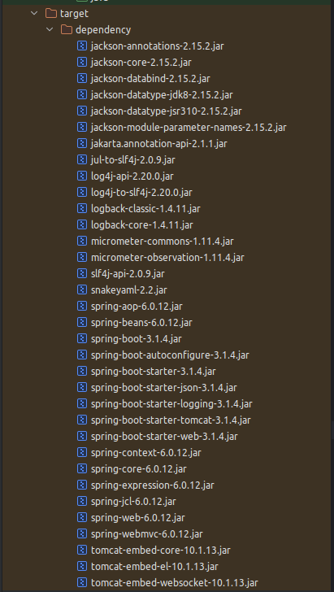
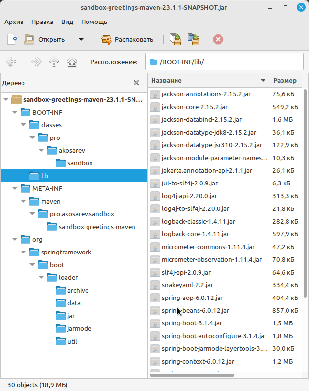
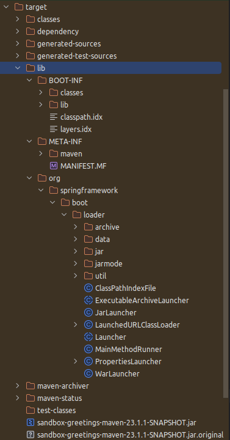
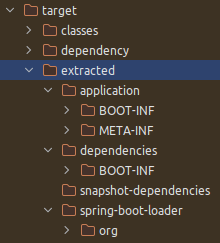

= Контейнеризация приложений Spring Boot с Maven
:toc:

Разработку и развёртывание современного серверного программного обеспечения невозможно представить себе без использования контейнеров, тем более, когда речь идёт о развёртывании в Kubernetes.
В этой статье я продемонстрирую несколько вариантов того, как можно упаковать Maven-проект на основе Spring Boot в контейнер в формате OCI (Open Container Initiative), ну или попросту в Docker-контейнер.

== Необходимые инструменты

Для выполнения сборки проекта и OCI-образов вам потребуется:

- OpenJDK 17+ (протестировано на BellSoft Liberica OpenJDK 17.0.8.1)
- Apache Maven 3.6.3+ (протестировано на Apache Maven 3.9.4)
- Docker (протестировано на Docker 24.0.6)

Все примеры протестированы на Linux Mint 21.2 Victoria, но так же должны работать и на других операционных системах.

== Подготовка проекта к упаковке в контейнер

Для упаковки приложения в контейнер потребуются все файлы, используемые приложением во время исполнения, и в случае с проектом на платформе Java в целом нам потребуются скомпилированные class-файлы проекта, различные ресурсы (конфигурационные yaml-файлы, html-страницы, изображения и т.д.), а так же jar-архивы с библиотеками.

При использовании Maven скомпилированные class-файлы и ресурсы мы можем взять из директории `target/classes`, в то время как jar-файлы библиотек лежат в локальном репозитории Maven (`.m2/repository` в домашней директории пользователя), и нам их нужно скопировать в одну директорию для упрощения работы с ними.
Предлагаю рассмотреть два варианта копирования библиотек: при помощи Maven Dependency Plugin и при помощи Spring Boot Maven Plugin.

=== Копирование зависимостей при помощи Maven Dependency Plugin

Для использования Maven Dependency Plugin потребуется добавить в `pom.xml` соответствующий плагин:

.pom.xml
[source,xml]
----
<project>
    <build>
        <plugins>
            <plugin>
                <groupId>org.apache.maven.plugins</groupId>
                <artifactId>maven-dependency-plugin</artifactId>
                <version>3.6.0</version>
            </plugin>
        </plugins>
    </build>
</project>
----

Подробную документацию по этому плагину вы можете изучить https://maven.apache.org/plugins/maven-dependency-plugin/usage.html[на странице плагина].

Скопировать зависимости проекта можно при помощи команды:

[source,shell]
----
mvn dependency:copy-dependencies -DincludeScope=runtime
----

Чтобы в директории с зависимостями оказались только зависимости, необходимые во время выполнения, я указал аттрибут `-DincludeScope=runtime`, в противном случае были бы скопированы вообще все зависимости, включая тестовые.

Можно не добавлять плагин в проект, в этом случае вам придётся указывать полное имя плагина:

[source,shell]
----
mvn org.apache.maven.plugins:maven-dependency-plugin:3.6.0:copy-dependencies -DincludeScope=runtime
----

Результатом выполнения этой команды будет директория `target/dependency` со всеми зависимостями, требуемыми во время выполнения:

.Зависимости проекта

Если вы добавили плагин в файл `pom.xml` вашего проекта, то зависимости будут копироваться и при вызове команды `mvn install`.

Теперь, когда у вас есть классы и ресурсы вашего проекта, а так же все необходимые зависимости, вы можете их все вместе собрать в одной директории и произвести тестовый запуск приложения:

[source,shell]
----
mkdir target/application
cp target/sandbox-greetings-maven-23.1.1-SNAPSHOT.jar target/application/application.jar
cp -r target/dependency target/application/lib
cd target/application
java -cp lib/*:application.jar pro.akosarev.sandbox.GreetingsMavenApplication
----

Альтернативно вы можете скопировать вместо jar-архива вашего проекта директорию `target/classes`, тогда копирование и запуск приложения будут выглядить так:

[source,shell]
----
mkdir target/application
cp -r target/classes/* target/application
cp -r target/dependency target/application/lib
cd target/application
java -cp lib/*:. pro.akosarev.sandbox.GreetingsMavenApplication
----

Примерно те же действия вам нужно будет выполнить при описании образа.

== Сборка образа

Теперь можно перейти к написанию Dockerfile для образа нашего проекта:

.maven-prebuilt.Dockerfile
[source,dockerfile]
----
# При помощи ключевого слова FROM необходимо указать исходный образ,
# который мы будем использовать для создания своего.
# Для данного примера выбран образ на основе Debian с установленным
# Liberica OpenJDK 17 версии, поскольку нам он нужен для запуска приложения.

FROM bellsoft/liberica-openjdk-debian:17

# Желательно запускать приложения не от имени суперпользователя, который
# используется по умолчанию, поэтому нужно создать пользователя и группу
# для запуска приложения.

RUN addgroup spring-boot-group && adduser --ingroup spring-boot-group spring-boot
USER spring-boot:spring-boot-group

# Иногда требуется получить доступ к файлам, генерирующимся в процессе выполнения,
# для этого зарегистрируем том /tmp

VOLUME /tmp

# Со временем у проекта будет изменяться версия, и чтобы не изменять всякий раз
# этот Dockerfile имя jar-файла вынесем в аргумент. Альтернативно можно указать
# постоянное имя jar-файла в Maven при помощи finalName.

ARG JAR_FILE=sandbox-greetings-maven-23.1.1-SNAPSHOT.jar

# Создадим рабочую директорию проекта

WORKDIR /application

# Скопируем в рабочую директорию проекта JAR-файл проекта и его зависимости

COPY target/${JAR_FILE} application.jar
COPY target/dependency lib

# В конце укажем точку входа. Выбран вариант с использованием exec для того, чтобы
# можно было передать в строку запуска дополнительные параметры запуска - JAVA_OPTS, а так же
# ${0} и ${@} для передачи аргументов запуска.

ENTRYPOINT exec java ${JAVA_OPTS} -cp lib/*:application.jar pro.akosarev.sandbox.GreetingsMavenApplication ${0} ${@}
----

Теперь мы можем собрать OCI-образ при помощи Docker:

[source,shell]
----
docker build -t sandbox-greetings-maven:23.1.1 .
----

При помощи аргумента `-t` задаётся тэг для собираемого образа, а точка в конце указывает на то, что в качестве сборочной директории нужно использовать текущую, в ней должен находиться Dockerfile.

Результат успешной сборки образа должен выглядеть примерно следующим образом:

[source,shell]
----
$ docker build -t sandbox-greetings-maven .
[+] Building 3.2s (10/10) FINISHED                                                 docker:default
 => [internal] load build definition from Dockerfile                                         0.0s
 => => transferring dockerfile: 609B                                                         0.0s
 => [internal] load .dockerignore                                                            0.1s
 => => transferring context: 2B                                                              0.0s
 => [internal] load metadata for docker.io/bellsoft/liberica-openjdk-debian:17               2.2s
 => [auth] bellsoft/liberica-openjdk-debian:pull token for registry-1.docker.io              0.0s
 => CACHED [1/4] FROM docker.io/bellsoft/liberica-openjdk-debian:
    17@sha256:260dc78f3c25a026acc68bc455585611850d3bf52791a5f17183b879c12d55fa               0.0s
 => [internal] load build context                                                            0.0s
 => => transferring context: 2.39kB                                                          0.0s
 => [2/4] WORKDIR /application                                                               0.2s
 => [3/4] COPY target/sandbox-greetings-maven-23.1.1-SNAPSHOT.jar application.jar            0.1s
 => [4/4] COPY target/dependency lib                                                         0.2s
 => exporting to image                                                                       0.2s
 => => exporting layers                                                                      0.2s
 => => writing image
    sha256:2f24c6300de7c6f6a45782bb6c0a5c0251b276b4137aa83f6a8714e270590980                  0.0s
 => => naming to docker.io/library/sandbox-greetings-maven                                   0.0s1
----

Теперь мы можем создать и запустить контейнер из нашего образа:

[source,shell]
----
docker run --name sandbox-greetings-maven sandbox-greetings-maven:23.1.1
----

Остановить и удалить контейнер мы можем при помощи `docker stop` и `docker rm`:

[source,shell]
----
docker stop sandbox-greetings-maven
docker rm sandbox-greetings-maven
----

Так же мы можем передавать параметры для приложения через переменные окружения и аргументы:

[source,shell]
----
docker run --name sandbox-greetings-maven -e SERVER_PORT=8081 sandbox-greetings-maven:23.1.1 --spring.profiles.active=sandbox
----

В данном примере я задал HTTP-порт 8081 и активный профиль sandbox.

На данном этапе полная сборка проекта в образ состоит из двух команд:

[source,shell]
----
mvn clean package dependency:copy-dependencies -DincludeScope=runtime
docker build -t sandbox-greetings-maven:23.1.1 .
----

Однако сборку образа мы можем сократить до одной команды `docker build ...`, переместив сборку maven-проекта тоже в Docker!
Очевидная выгода от такого решения заключается в отсутствии необходимости в Maven и JDK на компьютере, достаточно будет только Docker.
Для этого в самое начало нашего Dockerfile нужно дописать следующие строки:

[source,dockerfile]
----
# На этот раз нам требуется образ, содержащий maven, при помощи
# ключевого слова as мы указываем псевдоним для контейнера сборки,
# чтобы при его помощи в дальнейшем обращаться к контейнеру

FROM maven:3.9.4-eclipse-temurin-17 as build

# Собирать проект будем в /build

WORKDIR /build

# Теперь необходимо скопировать необходимые для сборки проекта файлы в конейнер

COPY src src
COPY pom.xml pom.xml

# И запустить сборку проекта. Загружаемые библиотеки желательно кэшировать между
# сборками,для этого нужно добавить --mount=type=cache,target=/root/.m2 к RUN

RUN --mount=type=cache,target=/root/.m2 mvn clean package dependency:copy-dependencies -DincludeScope=runtime
----

После этого нужно внести изменения в копирование файлов собранного проекта:

[source,dockerfile]
----

COPY --from=build /build/target/${JAR_FILE} application.jar
COPY --from=build /build/target/dependency lib
----

Весь Dockerfile теперь выглядит следующим образом (комментарии опущены):

.maven-full.Dockerfile
[source,dockerfile]
----
FROM maven:3.9.4-eclipse-temurin-17 as build
WORKDIR /build
COPY src src
COPY pom.xml pom.xml
RUN --mount=type=cache,target=/root/.m2  mvn clean package dependency:copy-dependencies -DincludeScope=runtime

FROM bellsoft/liberica-openjdk-debian:17
RUN addgroup spring-boot-group && adduser --ingroup spring-boot-group spring-boot
USER spring-boot:spring-boot-group
VOLUME /tmp
ARG JAR_FILE=sandbox-greetings-maven-23.1.1-SNAPSHOT.jar
WORKDIR /application
COPY --from=build /build/target/${JAR_FILE} application.jar
COPY --from=build /build/target/dependency lib
ENTRYPOINT exec java ${JAVA_OPTS} -cp lib/*:application.jar pro.akosarev.sandbox.GreetingsMavenApplication ${0} ${@}
----

Теперь OCI-образ собирается одной командой:

[source,shell]
----
docker build -t sandbox-greetings-maven:23.1.1 .
----

Полученный образ не отличается скромными размерами, и в моём случае его размер получается почти 300Мб!
Вы можете поэкспериментировать с используемыми JDK и JRE в основном образе, так замена `bellsoft/liberica-openjdk-debian:17` на `ubuntu/jre:17_edge` уменьшает размер образа до 170Мб.

== Spring Boot Maven Plugin и "толстый" JAR

Spring Boot Maven Plugin позволяет собирать "толстые" JAR-файлы, которые содержат не только классы и ресурсы вашего проекта, но и все зависимости, необходимые для его запуска.
Получить "толстый" JAR при сборке проекта вы можете, добавив в сборку проекта Spring Boot Maven Plugin с целью `repackage`:

.pom.xml
[source,xml]
----
<project>
    <build>
        <plugins>
            <plugin>
                <groupId>org.springframework.boot</groupId>
                <artifactId>spring-boot-maven-plugin</artifactId>
                <version>${spring-boot.version}</version>
                <executions>
                    <execution>
                        <goals>
                            <goal>repackage</goal>
                        </goals>
                    </execution>
                </executions>
            </plugin>
        </plugins>
    </build>
</project>
----

При использовании "толстого" JAR вам достаточно скопировать итоговый JAR-файл в образ и запустить его:

.fatjar.Dockerfile
[source,dockerfile]
----
FROM maven:3.9.4-eclipse-temurin-17 as build
WORKDIR /build
COPY src src
COPY pom.xml pom.xml
RUN --mount=type=cache,target=/root/.m2 mvn clean package

FROM bellsoft/liberica-openjdk-debian:17
RUN addgroup spring-boot-group && adduser --ingroup spring-boot-group spring-boot
USER spring-boot:spring-boot-group
VOLUME /tmp
ARG JAR_FILE=sandbox-greetings-maven-23.1.1-SNAPSHOT.jar
WORKDIR /application
COPY --from=build /build/target/${JAR_FILE} application.jar

# В случае с "толстым" JAR-архивом мы можем запускать приложение при помощи java -jar
ENTRYPOINT exec java ${JAVA_OPTS} -jar application.jar ${0} ${@}
----

Однако для ускорения запуска приложения вы можете распаковать его.

.Содержимое "толстого" JAR-архива проекта

Распаковать этот JAR-архив можно при помощи команды:

[source,shell]
----
mkdir -p target/lib
cd target/lib
jar -xf ../sandbox-greetings-maven-23.1.1-SNAPSHOT.jar
----

В результате чего в директории `target/lib` будут находиться все файлы из архива, а зависимости - в директории `target/lib/BOOT-INF/lib`:

Теперь собрать OCI-образ, аналогичный тому, что я собирал без использования Spring Boot Maven Plugin, можно следующим образом:

.fatjar-unpacked.Dockerfile
[source,dockerfile]
----
FROM maven:3.9.4-eclipse-temurin-17 as build
WORKDIR /build
COPY src src
COPY pom.xml pom.xml

# Чтобы не создавать лишние промежуточные слои, я объединяю команды в одну при помощи &&

RUN --mount=type=cache,target=/root/.m2 \
    mvn clean package && \
    mkdir -p target/lib && \
    cd target/lib && \
    jar -xf ../sandbox-greetings-maven-23.1.1-SNAPSHOT.jar

FROM bellsoft/liberica-openjdk-debian:17
RUN addgroup spring-boot-group && adduser --ingroup spring-boot-group spring-boot
USER spring-boot:spring-boot-group
VOLUME /tmp
ARG JAR_FILE=sandbox-greetings-maven-23.1.1-SNAPSHOT.jar
WORKDIR /application
COPY --from=build /build/target/lib/BOOT-INF/lib lib
COPY --from=build /build/target/lib/META-INF ./META-INF
COPY --from=build /build/target/lib/BOOT-INF/classes .
ENTRYPOINT java ${JAVA_OPTS} -cp lib/*:. pro.akosarev.sandbox.GreetingsMavenApplication ${0} ${@}
----

=== Spring Boot: слои и JarLauncher

Ещё один альтернативный способ запуска приложения, доступный нам при использовании Spring Boot Maven Plugin - загрузка через JarLauncher.
Кроме этого Spring Boot имеет встроенную поддержку слоёв, использование которых может сделать сборку Docker-образов более эффективной.
Распаковать "толстый" JAR-архив с использованием слоёв можно при помощи команды:

[source,shell]
----
java -Djarmode=layertools -jar target/sandbox-greetings-maven-23.1.1-SNAPSHOT.jar extract --destination target/extracted
----

В результате мы получим в директории `target/extracted` директории, соответствующие четырём слоям:

- `application` - файлы нашего проекта
- `dependencies` - runtime-зависимости проекта
- `snapshot-dependencies` - SNAPSHOT-зависимости проекта
- `spring-boot-loader` - файлы загрузчика Spring Boot

.Распакованные слои

Для запуска приложения нужно будет скопировать все четыре директории и выполнить команду:

[source,shell]
----
java org.springframework.boot.loader.JarLauncher
----

В Dockerfile это всё будет выглядеть следующим образом:

.fatjar-extracted.Dockerfile
[source,dockerfile]
----
FROM maven:3.9.4-eclipse-temurin-17 as build
WORKDIR /build
COPY src src
COPY pom.xml pom.xml

RUN --mount=type=cache,target=/root/.m2 \
    mvn clean package && \
    java -Djarmode=layertools \
    -jar target/sandbox-greetings-maven-23.1.1-SNAPSHOT.jar \
    extract --destination target/extracted

FROM bellsoft/liberica-openjdk-debian:17
RUN addgroup spring-boot-group && adduser --ingroup spring-boot-group spring-boot
USER spring-boot:spring-boot-group
VOLUME /tmp
ARG JAR_FILE=sandbox-greetings-maven-23.1.1-SNAPSHOT.jar
WORKDIR /application
COPY --from=build /build/target/extracted/application .
COPY --from=build /build/target/extracted/dependencies .
COPY --from=build /build/target/extracted/snapshot-dependencies .
COPY --from=build /build/target/extracted/spring-boot-loader .
ENTRYPOINT exec java org.springframework.boot.loader.JarLauncher ${0} ${@}
----

== Spring Boot Maven Plugin и сборка образов

Spring Boot Maven Plugin также предоставляет возможность собрать OCI-образ при помощи https://buildpacks.io/[Cloud Native Buildpacks], в этом случае вам даже не нужен Dockerfile, достаточно Spring Boot Maven Plugin в pom.xml вашего проекта.
Сборка образа осуществляется при помощи команды:

[source,shell]
----
mvn spring-boot:build-image
----

Настроить параметры собираемого образа можно при помощи параметров https://docs.spring.io/spring-boot/docs/3.1.4/maven-plugin/reference/htmlsingle/[Spring Boot Maven Plugin]:

[source,xml]
----
<project>
  <build>
    <plugins>
      <plugin>
        <groupId>org.springframework.boot</groupId>
        <artifactId>spring-boot-maven-plugin</artifactId>
        <version>${spring-boot.version}</version>
        <configuration>
          <image>
            <!-- Имя образа -->
            <name>sandbox-greetings-maven</name>
            <!-- Список используемых Buildpacks -->
            <buildpacks>
              <buildpack>paketobuildpacks/ca-certificates:3.6.3</buildpack>
              <buildpack>paketobuildpacks/bellsoft-liberica:10.4.0</buildpack>
              <buildpack>paketobuildpacks/syft:1.32.1</buildpack>
              <buildpack>paketobuildpacks/executable-jar:6.7.4</buildpack>
              <buildpack>paketobuildpacks/dist-zip:5.6.4</buildpack>
              <buildpack>paketobuildpacks/spring-boot:5.26.1</buildpack>
            </buildpacks>
            <!-- Список пробрасываемых директорий в Buildpacks -->
            <bindings>
              <binding>${project.basedir}/platform/bindings:/platform/bindings</binding>
            </bindings>
          </image>
        </configuration>
      </plugin>
    </plugins>
  </build>
</project>
----

В указанном примере я указал своё название образа, хотя в данном случае это не обязательно, т.к. оно соответствует названию проекта.
Так же я изменил список используемых Buildpacks, т.к. мне нужна была версия `packetobuildpacks/bellsoft-liberica` 10.4.0, а не 10.2.6, но несмотря на то, что изменения касаются только одного Buildpack, указывать нужно их все.
Так же я при помощи `<bindings>` прокинул локальную директорию с самоподписанным CA-сертификатом в контейнер сборки, чтобы в дальнейшем приложение могло использовать защищённые соединения.